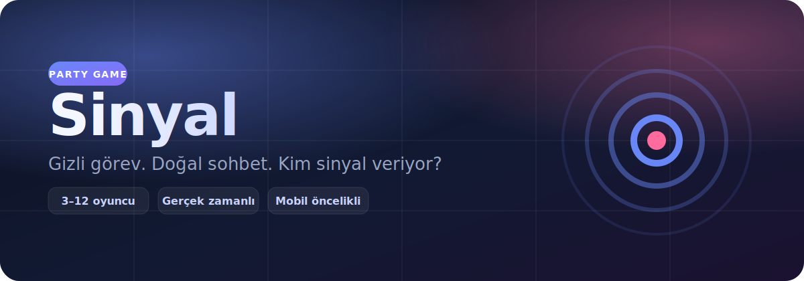

<p align="center">
  
</p>

<p align="center">
  <strong>Gizli bir Sinyalci. Doğal bir sohbet. Kim sinyal veriyor?</strong><br/>
  Arkadaşlarınla aynı odada, herkes kendi telefonundan oynanan gerçek zamanlı parti oyunu.
</p>

<p align="center">
  <a href="https://yunusemredurak.com.tr/sinyal/"></a>
  &nbsp;
  <a href="https://r00twr3nch.github.io/sinyal/"></a>
  &nbsp;
  <a href="https://github.com/r00twr3nch/sinyal/stargazers"></a>
</p>

<p align="center">
  
  
  
  
  
</p>

---

## Oyun nedir?

Her turda rastgele **bir kişi Sinyalci** seçilir. Sadece onun ekranında gizli bir davranış görevi görünür — örneğin cümlelere “aslında” ile başlamak, herkese soru sormak, abartılı iltifat etmek.

Diğerleri normal sohbet ederken kim olduğunu ve ne yaptığını çözmeye çalışır. Süre bitince oylama; puanlar dağılır; yeni tur.

| | |
|---|---|
| 👥 **3–12 oyuncu** | Aynı masada, herkes kendi telefonundan |
| 🕵️ **Gizli rol** | Sinyalci kimliği oylamaya kadar gizli kalır |
| ⏱️ **Zamanlı tur** | Varsayılan ~3.5 dk sohbet + oylama |
| 📱 **Mobil öncelik** | Karanlık, dokunmatik UI |

---

## Nasıl oynanır?

```text
  Oda kur ──► Kod paylaş ──► Herkes katılsın (min 3)
       │
       ▼
  Tur başlar ──► 1 kişi Sinyalci + gizli görev
       │
       ▼
  Sohbet / gözlem ──► Süre biter
       │
       ▼
  Oylama ──► Kim? Hangi görev? ──► Sonuç + puan
```

1. Biri **Oda Kur** der, oda kodunu paylaşır  
2. Diğerleri **Koda Katıl** ile girer  
3. Kurucu süreyi seçip oyunu başlatır  
4. Sinyalci görevini doğal şekilde uygular  
5. Herkes tahminini yapar, sonuçlar açılır  

### Puanlama

| Durum | Puan |
|--------|:----:|
| Sinyalciyi doğru bilmek | **+2** |
| Görevi doğru bilmek | **+1** |
| Sinyalci: ≥2 kişi buldu, çok belli değil | **+3** |
| Sinyalci: neredeyse herkes buldu | **−2** |
| Sinyalci: kimse bulamadı | **+1** |

---

## Hızlı başlangıç

```bash
# Node 20+
npm install
npm run dev
```

| | Adres |
|---|---|
| Web | http://localhost:5173 |
| API / Socket | http://localhost:3001 |
| Sağlık | http://localhost:3001/health |

Aynı Wi‑Fi’deki telefondan: `http://<bilgisayar-ip>:5173`  
Gerekirse kökte `.env`:

```env
VITE_SERVER_URL=http://192.168.1.20:3001
```

---

## Stack

```text
┌─────────────┐     Socket.IO      ┌──────────────────┐
│  React +    │ ◄────────────────► │  Express +       │
│  Vite (UI)  │                    │  RoomManager     │
└─────────────┘                    └──────────────────┘
   GitHub Pages                       Render (Node)
   yunusemredurak.com.tr/sinyal       sürekli process
```

| Katman | Teknoloji |
|--------|-----------|
| İstemci | React 19, TypeScript, Vite, socket.io-client |
| Sunucu | Express 5, Socket.IO, tsx |
| Oda durumu | Bellek içi (`RoomManager`) — DB yok |
| Fazlar | `lobby` → `playing` → `voting` → `results` |

### Komutlar

| Komut | Açıklama |
|--------|----------|
| `npm run dev` | Sunucu + istemci birlikte |
| `npm run build` | Üretim derlemesi |
| `npm start` | Sunucuyu başlat |
| `npm run lint` | Oxlint |

### Klasörler

```text
src/                 React UI (mobil öncelikli)
server/game.ts       Oda / tur / puan mantığı
server/signals.ts    Gizli görev havuzu
server/index.ts      Express + Socket.IO
.github/workflows/   GitHub Pages deploy
render.yaml          Render blueprint
```

---

## Canlı ortam

| Parça | URL |
|--------|-----|
| 🎮 Oyun (önerilen) | [yunusemredurak.com.tr/sinyal](https://yunusemredurak.com.tr/sinyal/) |
| 📄 GitHub Pages | [r00twr3nch.github.io/sinyal](https://r00twr3nch.github.io/sinyal/) |
| 🔌 Backend health | [sinyal-1-1h9v.onrender.com/health](https://sinyal-1-1h9v.onrender.com/health) |

> Ücretsiz Render planında servis uyuyabilir; ilk istek 30–60 sn sürebilir.

### Kendi deploy’un

Socket.IO **uzun ömürlü Node process** ister — Vercel serverless uygun değil.

**A) Monolit (en basit)** — Render Blueprint (`render.yaml`): UI + socket aynı origin.

**B) Hibrit (şu anki)** — Pages/UI + Render socket:

1. Render’da Web Service → `npm install --include=dev && npm run build` / `npm start`  
2. `CLIENT_ORIGIN` = UI origin’lerin (virgülle)  
3. Pages Actions secret: `VITE_SERVER_URL=https://….onrender.com`  
4. `main` push → Pages build  

Secret yoksa ana ekrandaki **Sunucu ayarı** ile tarayıcıya URL yazılabilir (`localStorage`).

Detaylı env örnekleri: [`.env.example`](.env.example)

---

## Katkı

Issue / PR açık. Özellikle şunlar değerli:

- Yeni görevler → [`server/signals.ts`](server/signals.ts)  
- Kural ince ayarı → [`server/game.ts`](server/game.ts)  
- UI kopyası Türkçe kalsın  

```bash
git clone https://github.com/r00twr3nch/sinyal.git
cd sinyal
npm install
npm run dev
```

---

<p align="center">
  <sub>Yapıldı · oynandı · sinyal verildi</sub><br/>
  <a href="https://yunusemredurak.com.tr/sinyal/">▶ Hemen oyna</a>
  ·
  <a href="https://github.com/r00twr3nch/sinyal/issues">Issue aç</a>
</p>
